```
Write query for listing requirement and snapshot the result (run time and execution plan)
    1. Total revenue per month
    2. Orders filtered by seller and date
    3. Filter data in `order_item` by product_id
    4. Find order with highest total_amount
    5. List products with highest quantity sold
    6. Orders by Seller in October
    7. Revenue per Product per Month
    8. Products Sold per Seller
- Create monthly partitions for the two tables above and create an index on the `product_id` column of `order_item` table.
- Write query for above requirements again and snapshot the result (run time and execution plan); then compare
```


#### 1. Total revenue per month
[01_revenue_per_month.sql](../queries/01_revenue_per_month.sql)


##### After:

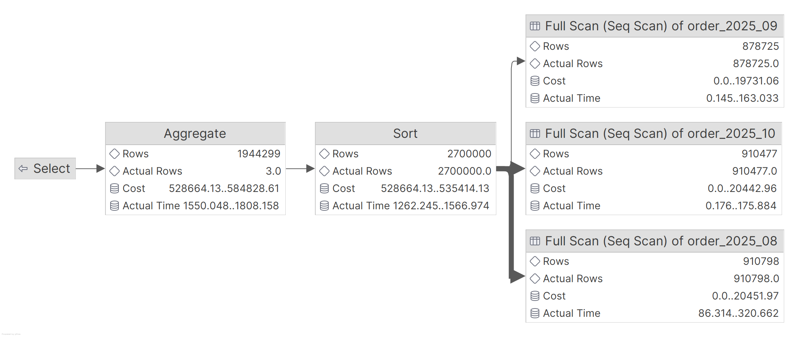
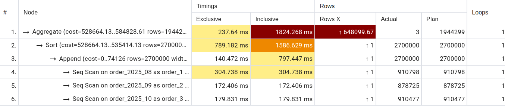


| Metric     | Before     | After      | Compare |
| ---------- | ---------- | ---------- | ------- |
| Total time | 1674 ms    | 1824       | Slower  |
| Rows scan  | 2700000    | 2700000    | same    |
| Scan type  | 1 Seq Scan | 3 Seq Scan | same    |

- No partition pruning: Query does not use where order_date -> full scan & append
- Consider indexing or materialized views instead.

#### 2. Orders filtered by seller and date
[02_orders_by_seller_date.sql](../queries/02_orders_by_seller_date.sql)


##### After:

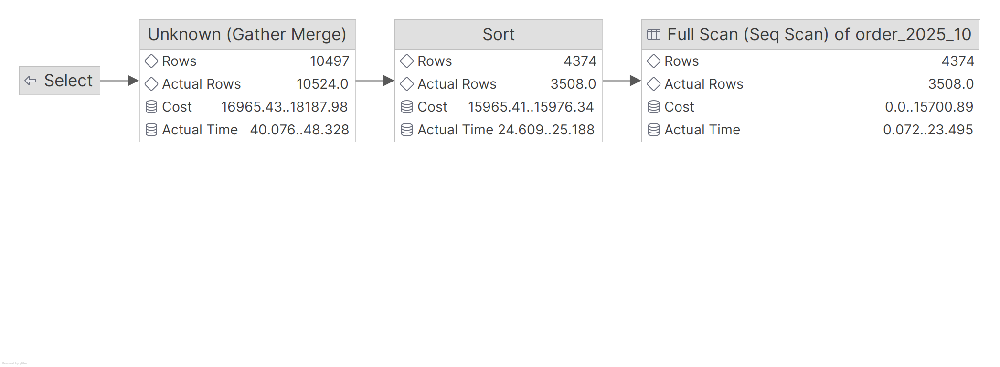
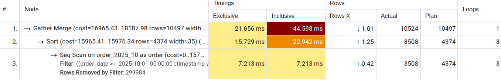


| Metric               | Before       | After        | Improvement |
|----------------------|--------------|--------------|-------------|
| Total Execution Time | 98.738 ms    | 44.598 ms    | -54.8%      |
| Total Cost           | 72253.49     | 16965.43     | -76.5%      |
| Rows Processed       | 10524        | 10524        | =           |
| Actual Rows Returned | 3,508        | 3,508        | =           |
| Main Operation       | Gather Merge | Gather Merge | Same        |
| Sequential Scan Time | 22.934 ms    | 7.213 ms     | -68.6%      |
| Rows Filtered        | ~896,492     | 299,984      | -66.5%      |

###### Improvements

- Partition pruning working: Only scans `order_2025_10` partition
- Fewer rows filtered: Reduced from ~900K to ~300K rows
- Sort & can faster

###### Issues
- Still uses Seq Scan instead of Index Scan
- Sort operation still costly (15,729 ms)

#### 3. Filter data in `order_item` by product_id
[03_items_by_product.sql](../queries/03_items_by_product.sql)


##### After:
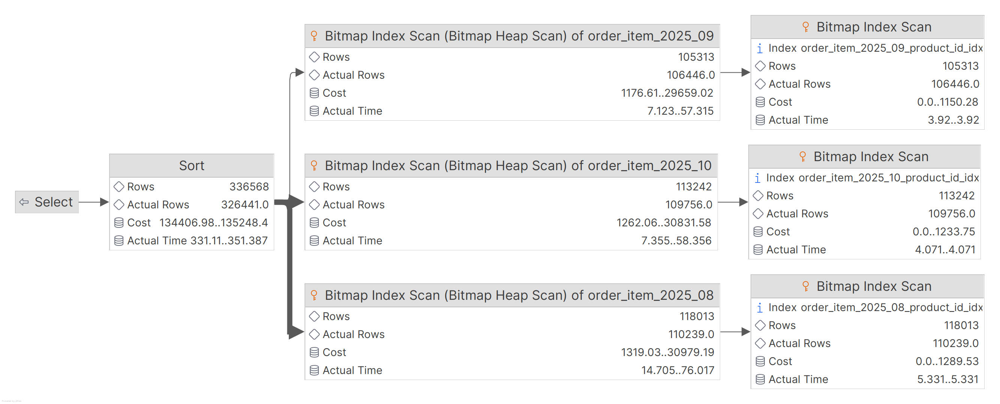
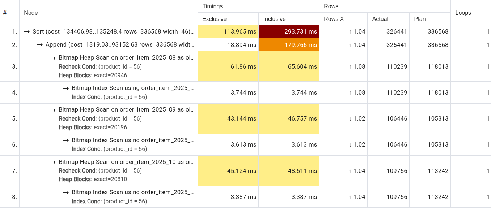

| Metric               | Before               | After             | Change         |
|----------------------|----------------------|-------------------|----------------|
| Total Execution Time | 272.857 ms           | 293.731 ms        | +7.6% (slower) |
| Total Cost           | 142,418.46           | 134,406.98        | -5.6%          |
| Actual Rows Returned | 326,441              | 326,441           | =              |
| Plan Rows            | 325,344              | 336,568           | +3.5%          |
| Main Operation       | Gather Merge -> Sort | Sort -> Append    | Changed        |
| Scan Type            | Parallel Seq Scan    | Bitmap Index Scan | Use index      |
| Partitions Scanned   | All (entire table)   | 3 partitions      | =              |
| Sort Time            | 161.667 ms           | 113.965 ms        | -28.5%         |
| Rows Filtered        | 2,591,132            | 0 (index used)    | No filtering   |

- Index is being used: `idx_order_item_product_id` successfully applied
- No row filtering: Index eliminates need to filter
- Sort improved

###### Issues
- Overall slower: Despite index usage, total time increased by 7.6%  
- Append overhead to combine results from 3 partitions  
- Bitmap Heap Scan cost: Each partition scan takes 43-65 ms  
- Trade-off: Index scan saved filtering time but added partition coordination overhead

The query got slower because:
- there's no partition pruning 
- While index helps with filtering, the partition append overhead exceeds the benefit 
- Before: Single parallel scan of entire table 
- After: 3 separate index scans + expensive append operation

#### 4. Find order with highest total_amount
[04_highest_order.sql](../queries/04_highest_order.sql)


##### After:
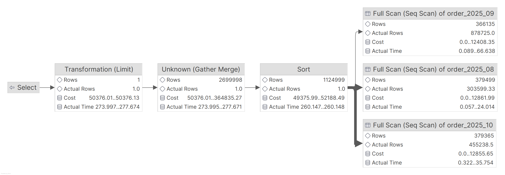
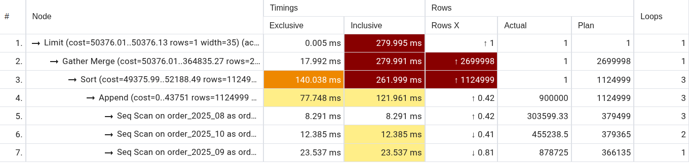


| Metric               | Before                      | After                                | Improvement     |
|----------------------|-----------------------------|--------------------------------------|-----------------|
| Total Execution Time | 296.862 ms                  | 279.995 ms                           | -5.7%           |
| Total Cost           | 69,207.41                   | 50,376.01                            | -27.2%          |
| Actual Rows Returned | 1                           | 1                                    | =               |
| Rows Processed       | 900,000 (est.)              | 900,000                              | =               |
| Main Operation       | Limit - Gather Merge - Sort | Limit - Gather Merge - Sort - Append | Partition aware |
| Sort Time            | 240.495 ms                  | 140.038 ms                           | -41.7%          |
| Scan Type            | Parallel Seq Scan           | Seq Scan (3 partitions)              | =               |
| Partitions Scanned   | All partitions              | order_2025_08, 09, 10                | Reduced         |
| Gather Merge Time    | 24.517 ms                   | 17.992 ms                            | -27.6%          |


- Sort faster : 41.7% reduction in sort time (240ms → 140ms)  
- Lower cost : Planning cost reduced by 27.2%  
- Gather Merge improved : 27.6% faster merge operation  

###### Issues
- NO partition pruning: Query has no WHERE clause on partition key (order_date)
- Append overhead added
- Still sorts entire dataset:
  - Sorting 900,000 rows just to get LIMIT 1  
  - No index on `total_amount`
###### Root Cause
Modest improvement (5.7%) comes from:
* Better parallelization in After case
* Sort optimization
* NOT from partition pruning

The improvement is limited because:
* Partitioning adds Append overhead
* Still requires full table scan across all partitions
* No index utilization on total_amount

#### 5. List products with highest quantity sold
[05_top_products_by_quantity.sql](../queries/05_top_products_by_quantity.sql)


##### After:
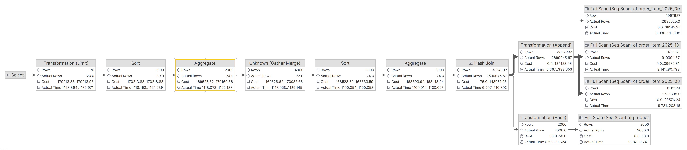
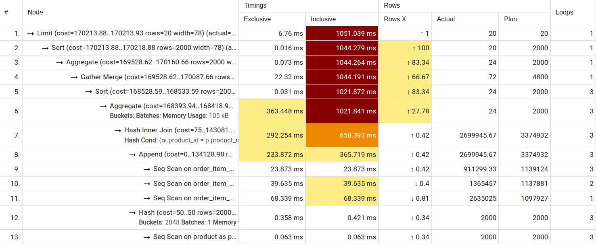

| Metric               | Before             | After            | Change          |
|----------------------|--------------------|------------------|-----------------|
| Total Execution Time | 936.869 ms         | 1051.039 ms      | +12.2% (SLOWER) |
| Total Cost           | 153,338.64         | 170,213.88       | +11.0%          |
| Hash Join Time       | 469.252 ms         | 292.254 ms       | -37.7%          |
| Append Time          | N/A                | 233.872 ms       | New Overhead    |
| Seq Scan Time        | 43.328 ms          | 131.847 ms       | +204%           |
| Aggregate Time       | 383.264 ms         | 363.448 ms       | -5.2%           |
| Partitions Scanned   | All (single table) | All 3 partitions | = (NO PRUNING)  |

Partitioning hurts full-table aggregations without partition key filtering.
The scan & append operation overhead outweighs any optimization gains.
###### Root Cause
-  NO partition pruning: Query scans all 3 partitions (no WHERE on partition key)  
-  Append overhead: 233.872 ms to combine partition results  
-  Multiple scans worse: 3 separate scans (23.873 + 39.635 + 68.339 = 131ms) vs 1 scan (43ms)  
-  Net loss: Append overhead (233ms) exceeds savings from faster join/aggregate (197ms)

#### 6. Orders by Seller in October
[06_seller_orders_october.sql](../queries/06_seller_orders_october.sql)


##### After:
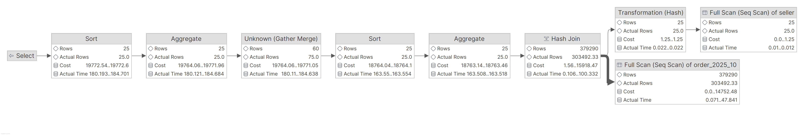
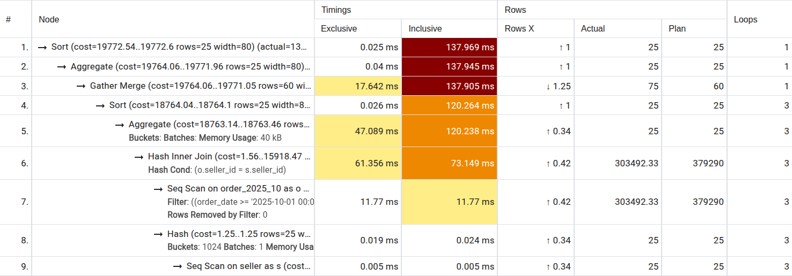

| Metric                | Before         | After              | Change  |
|-----------------------|----------------|--------------------|---------|
| Total Execution Time  | 212.757 ms     | 137.969 ms         | - 35.2% |
| Total Cost            | 203,989        | 19,772.54          | - 90.2% |
| Rows Returned         | 25             | 25                 | =       |
| Hash Join Time        | 103.795 ms     | 61.356 ms          | - 40.9% |
| Seq Scan Time (order) | 25.799 ms      | 11.77 ms           | - 54.4% |
| Rows Filtered (order) | 596,508        | 0                  | =       |
| Partitions Scanned    | All partitions | Only order_2025_10 | PRUNING |
| Aggregate Time        | 57.645 ms      | 47.089 ms          | - 18.3% |

- Partition pruning works
  - WHERE clause: `order_date >= '2025-10-01' AND order_date < '2025-11-01'`
  - Only scans `order_2025_10` partition
  - Skips `order_2025_08` and `order_2025_09` completely
- Fewer rows to filter :
  - Before: Scanned entire table, filtered 596,508 rows
  - After: Scanned only 1 partition, filtered 0 rows (all match)
- Faster hash join : 103.795ms -> 61.356ms (40.9% improvement)
- Faster sequential scan : 25.799ms -> 11.77ms (54.4% improvement)

#### 7. Revenue per Product per Month
[07_product_revenue_per_month.sql](../queries/07_product_revenue_per_month.sql)


##### After:
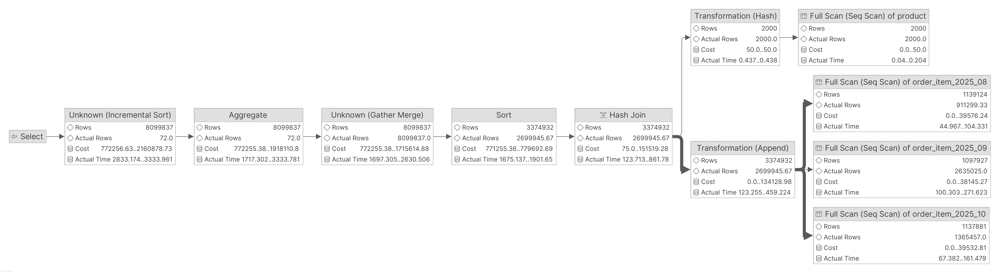
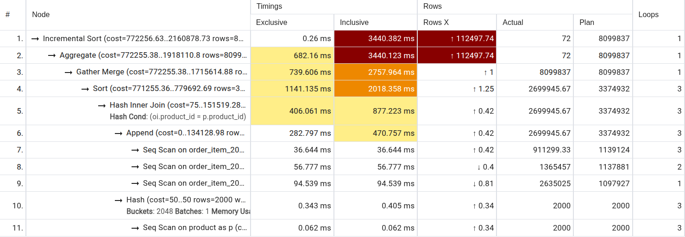


| Metric                     | Before             | After            | Change         |
|----------------------------|--------------------|------------------|----------------|
| Total Execution Time       | 3677.12 ms         | 3440.382 ms      | - 6.4%         |
| Total Cost                 | 755,383.74         | 772,256.63       | + 2.2%         |
| Rows Returned              | 72                 | 72               | =              |
| Hash Join Time             | 541.873 ms         | 406.061 ms       | - 25.1%        |
| Sort Time                  | 1271.211 ms        | 1141.135 ms      | - 10.2%        |
| Aggregate Time             | 788.718 ms         | 682.16 ms        | - 13.5%        |
| Seq Scan Time (order_item) | 46.244 ms          | 188.96 ms        | + 308%         |
| Partitions Scanned         | All (single table) | All 3 partitions | = (NO PRUNING) |
| Append Time                | N/A                | 282.797 ms       | OVERHEAD       |

_Scan Breakdown:_

BEFORE: Single scan: 46.244 ms for entire `order_item` table

AFTER:
- Total: 188.96 ms  (4x slower than single scan)
  - Partition 08: 36.644 ms (911,299 rows)
  - Partition 09: 56.777 ms (1,365,457 rows)
  - Partition 10: 94.539 ms (2,635,025 rows)
-  Append: 282.797 ms  (overhead)

###### Key Insight

This query has  NO benefit from partitioning  because:
- No WHERE clause on `order_date` -> scans all partitions
- GROUP BY uses `DATE_TRUNC(order_date)` -> needs all historical data
- Append overhead (282ms) is significant
- Multiple scans (188ms) vs single scan (46ms) is inefficient

The slight improvement is likely from:
- Better parallel processing of aggregations
- More efficient sort/merge operations


#### 8. Products Sold per Seller
[08_products_per_seller.sql](../queries/08_products_per_seller.sql)


##### After:

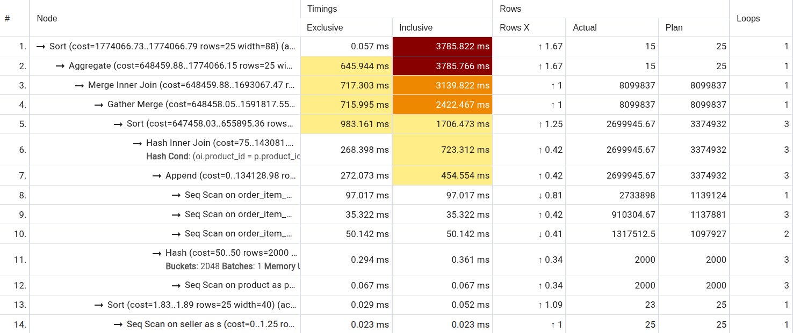

| Metric                     | Before             | After            | Change          |
|----------------------------|--------------------|------------------|-----------------|
| Total Execution Time       | 3593.345 ms        | 3785.822 ms      | + 5.4% (SLOWER) |
| Total Cost                 | 1,757,207.85       | 1,774,066.73     | + 1.0%          |
| Rows Returned              | 15                 | 15               | =               |
| Hash Join Time             | 396.201 ms         | 268.398 ms       | - 32.3%         |
| Sort Time                  | 963.679 ms         | 983.161 ms       | + 2.0%          |
| Aggregate Time             | 623.22 ms          | 645.944 ms       | + 3.6%          |
| Seq Scan Time (order_item) | 43.752 ms          | 182.481 ms       | + 317%          |
| Partitions Scanned         | All (single table) | All 3 partitions | = (NO PRUNING)  |
| Append Time                | N/A                | 272.073 ms       | OVERHEAD        |

Only improvement : Hash join -32.3% (127 ms saved)

This is a complex 3-table join with aggregation and partitioning hurts performance because:
- No date filtering → no partition pruning
- Append overhead (272ms) for combining partitions
- Multiple partition scans (182ms) vs single scan (43ms)
- Hash join improvement can't offset partition overhead
- Additional memory pressure from partition coordination


### Create partition

Run script: [create_partitions.sql](../sql/create_partitions.sql)

```shell
[2026-02-21 15:40:28] completed in 5 ms
[2026-02-21 15:40:28] ecommerce_oltp.public> CREATE TABLE order_2025_10 PARTITION OF order_partitioned
                                                 FOR VALUES FROM ('2025-10-01') TO ('2025-11-01')
[2026-02-21 15:40:28] completed in 4 ms
[2026-02-21 15:40:28] ecommerce_oltp.public> CREATE TABLE order_item_partitioned (
                                                 order_item_id BIGSERIAL,
                                                 order_id INT NOT NULL,
                                                 product_id INT NOT NULL,
                                                 order_date TIMESTAMP NOT NULL,
                                                 quantity INT NOT NULL,
                                                 unit_price NUMERIC(10,2) NOT NULL,
                                                 subtotal NUMERIC(12,2) NOT NULL,
                                                 created_at TIMESTAMP DEFAULT NOW(),
                                                 CONSTRAINT order_item_part_pkey PRIMARY KEY (order_item_id, order_date)
                                             ) PARTITION BY RANGE (order_date)
[2026-02-21 15:40:28] completed in 5 ms
[2026-02-21 15:40:28] ecommerce_oltp.public> CREATE TABLE order_item_2025_08 PARTITION OF order_item_partitioned
                                                 FOR VALUES FROM ('2025-08-01') TO ('2025-09-01')
[2026-02-21 15:40:28] completed in 5 ms
[2026-02-21 15:40:28] ecommerce_oltp.public> CREATE TABLE order_item_2025_09 PARTITION OF order_item_partitioned
                                                 FOR VALUES FROM ('2025-09-01') TO ('2025-10-01')
```

#### Migrate from generated data

Script: [migrate_to_partitions.sql](../sql/migrate_to_partitions.sql)

```shell
[2026-02-21 15:46:44] ecommerce_oltp.public> INSERT INTO order_partitioned (order_id, order_date, seller_id, status, total_amount, created_at)
                                             SELECT order_id, order_date, seller_id, status, total_amount, created_at
                                             FROM "order"
[2026-02-21 15:46:59] 2,700,000 rows affected in 15 s 377 ms
[2026-02-21 15:46:59] ecommerce_oltp.public> INSERT INTO order_item_partitioned (order_item_id, order_id, product_id, order_date, quantity, unit_price, subtotal, created_at)
                                             SELECT order_item_id, order_id, product_id, order_date, quantity, unit_price, subtotal, created_at
                                             FROM order_item
[2026-02-21 15:47:11] 8,099,837 rows affected in 11 s 528 ms
```

### Create indexes
Script: [create_indexes.sql](../sql/create_indexes.sql)
