```
Write query for listing requirement and snapshot the result (run time and execution plan)
    1. Total revenue per month
    2. Orders filtered by seller and date
    3. Filter data in `order_item` by product_id
    4. Find order with highest total_amount
    5. List products with highest quantity sold
    6. Orders by Seller in October
    7. Revenue per Product per Month
    8. Products Sold per Seller
- Create monthly partitions for the two tables above and create an index on the `product_id` column of `order_item` table.
- Write query for above requirements again and snapshot the result (run time and execution plan); then compare
```

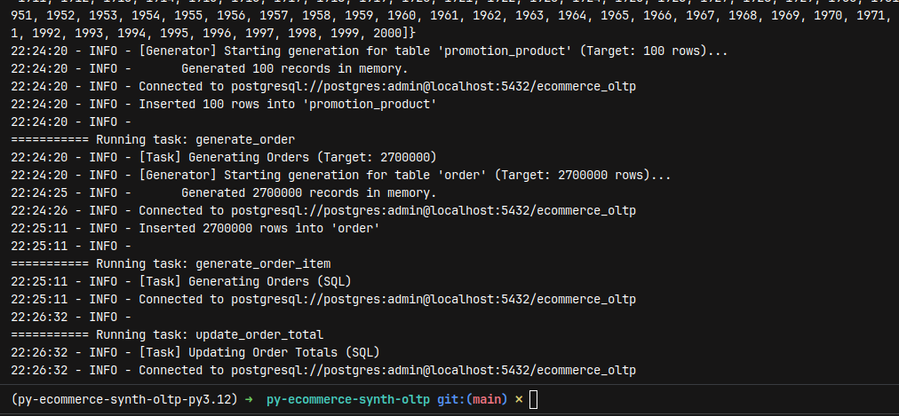


#### 1. Total revenue per month
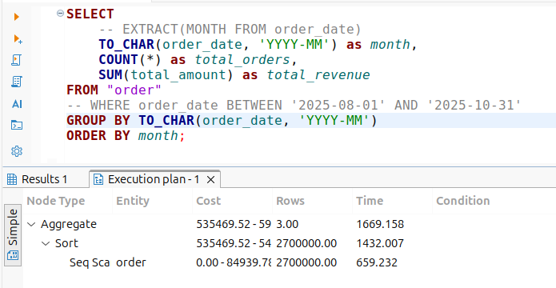

After:

#### 2. Orders filtered by seller and date
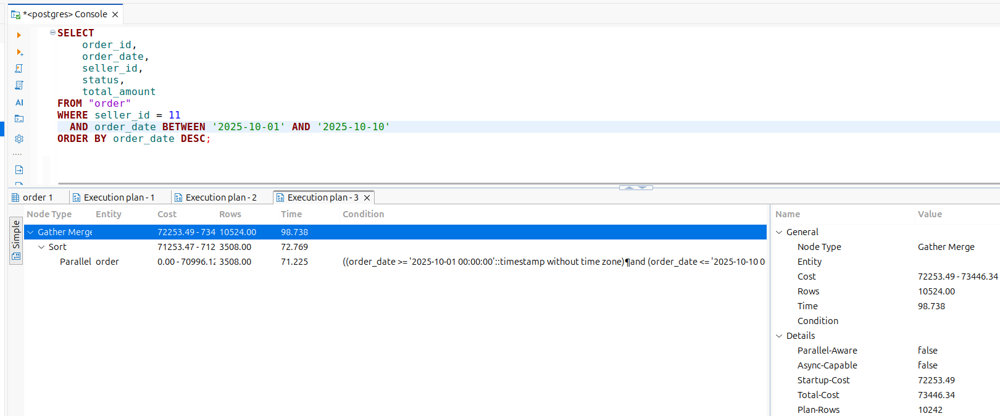


#### 3. Filter data in `order_item` by product_id
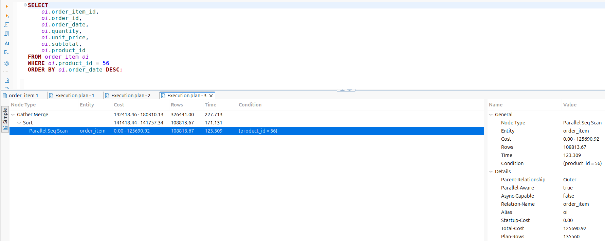
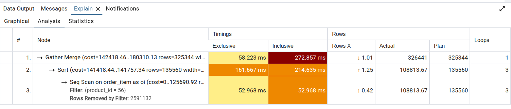

#### 4. Find order with highest total_amount
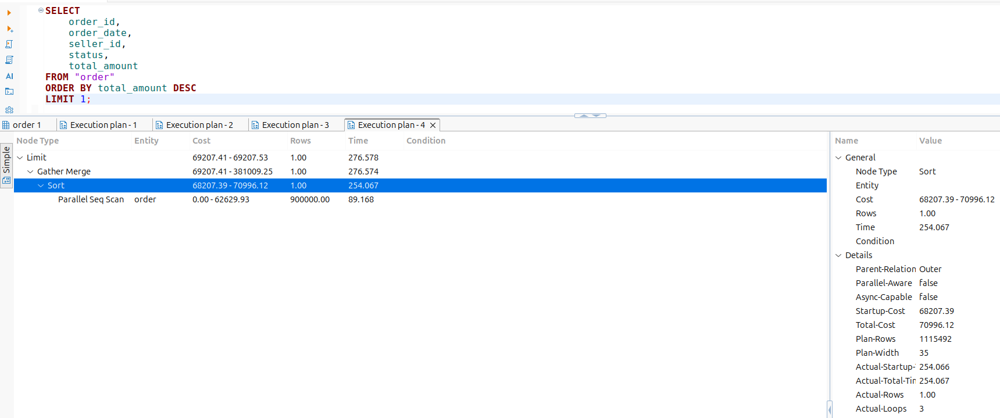
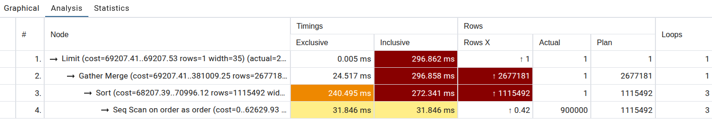

#### 5. List products with highest quantity sold
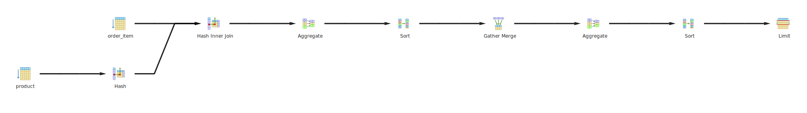
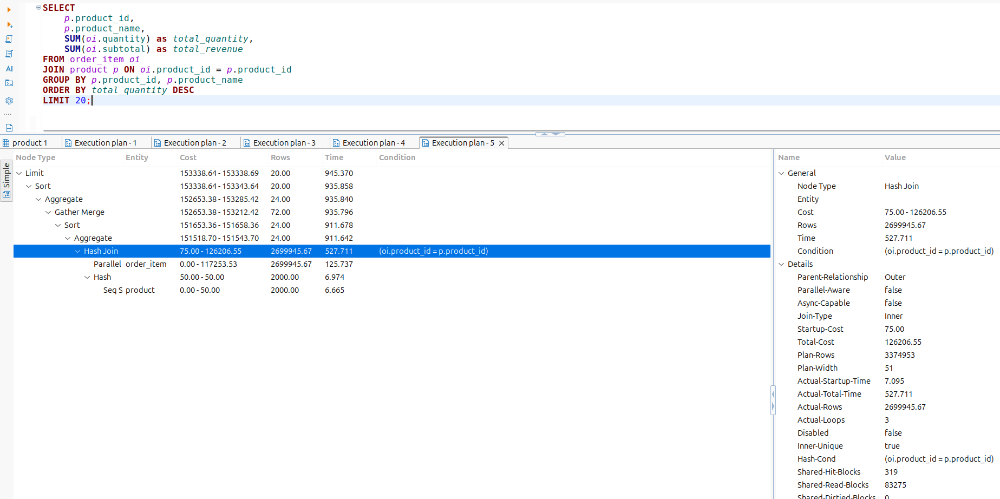
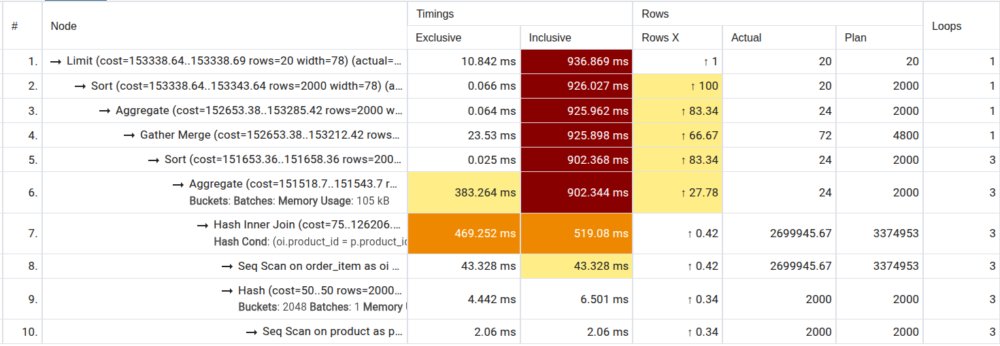
#### 6. Orders by Seller in October
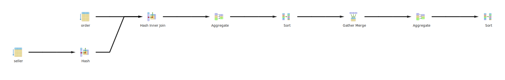
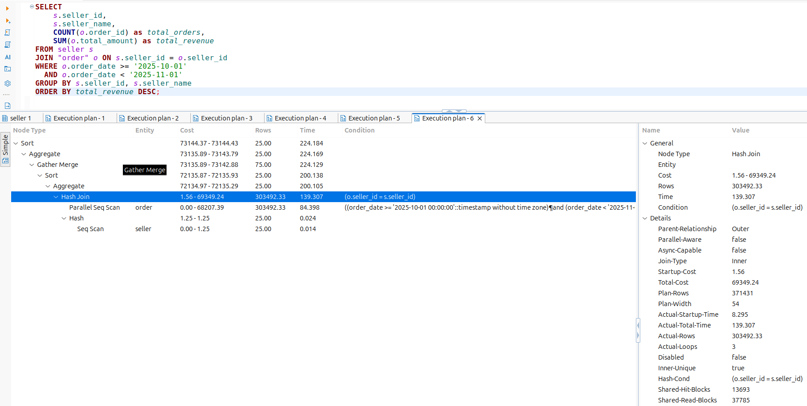
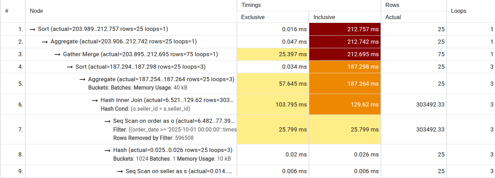

#### 7. Revenue per Product per Month
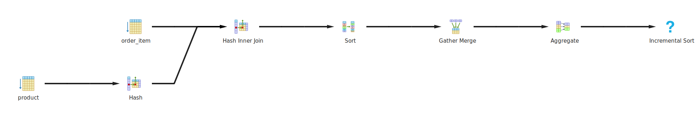
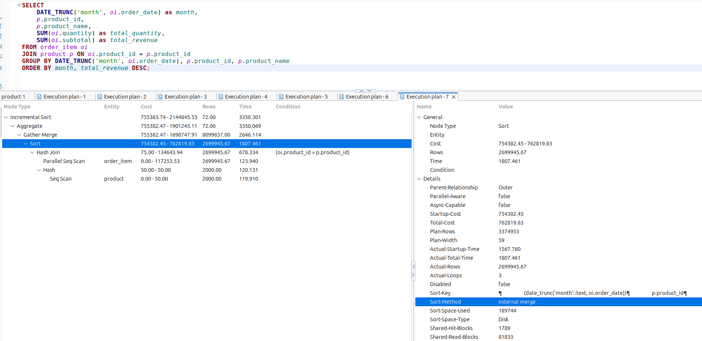
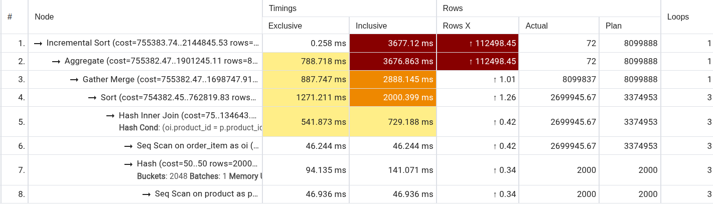

#### 8. Products Sold per Seller
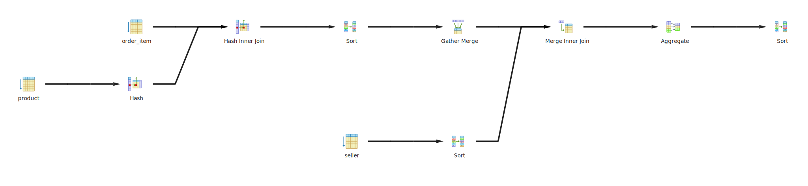
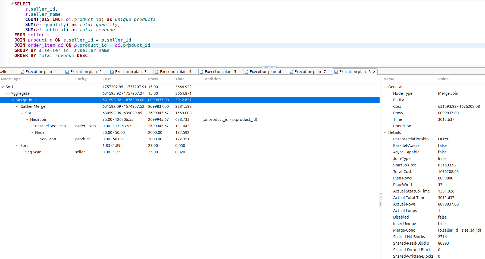
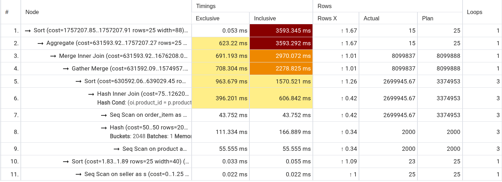
