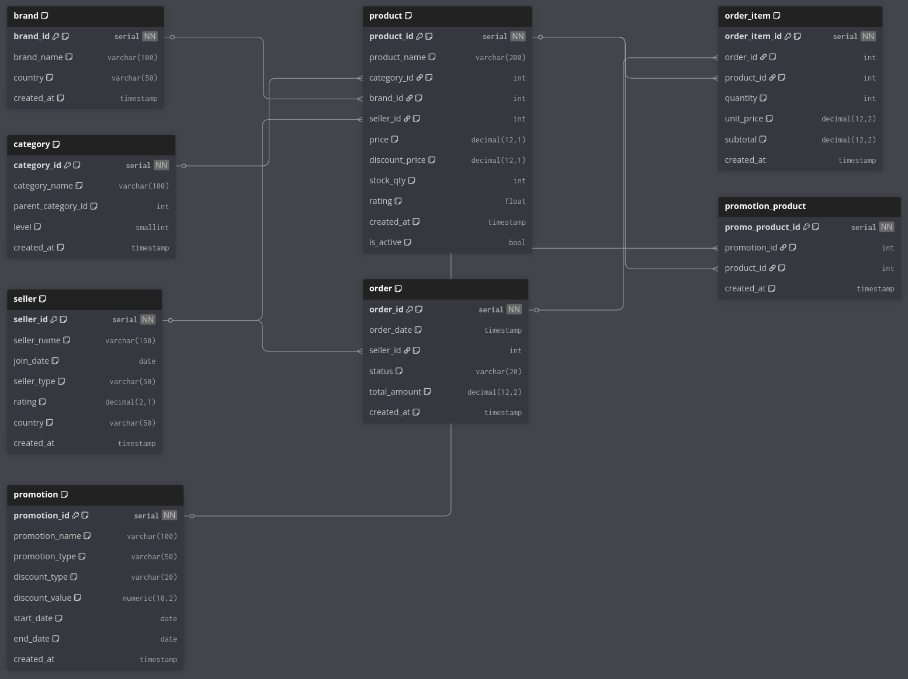

# E-Commerce Synthetic OLTP System

## References

- https://www.geeksforgeeks.org/artificial-intelligence/synthetic-data-generation/

## Execution Plan

### 1: Setup

- Select database
- Use poetry to setup structure

### 2: Schema Design

### 3: Data generation strategy

#### Dependency order

Categories based on schema design: Independent -> Dependent -> Transactional

* Master data: Core entities, slow-changing, independent/dependent
* Reference & associative data: Lookup table, classification, dependent/independent
* Transactional data: transaction, event, fast-changing

| Level | Category                       | Tables                   | Dependencies                             | Generation Order      |
|-------|--------------------------------|--------------------------|------------------------------------------|-----------------------|
| 0     | Independent master & reference | brand, seller, promotion | No                                       | parallel OK           |
|       | -                              | category                 | self-ref                                 | parent -> category    |
| 1     | Dependent master               | product                  | brand_id, category_id, seller_id | after L0              |
| 2     | Associative data               | promotion_product        | promotion_id product_id              | after L0 + products   |
| 3     | Transactional data (header)    | order                    | seller                                   | after L1              |
|       | Transactional data (detail)    | order_item               | order, products                          | after L1 + with order |

### 4: Implementation - Core

Core modules:

- Utils: logging
- Config
- Exception
- Database, schema
- Entrypoint
- Generators

### 5: Implementation - Runner
- pipeline tasks
- entrypoint

